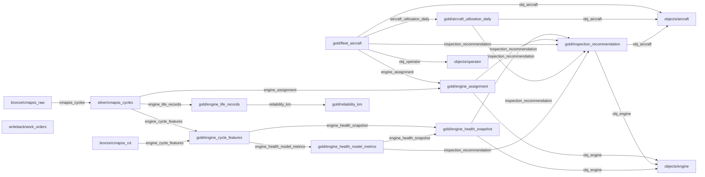

# Lineage (generated by `python -m aerolisa.cli lineage`)

```mermaid
flowchart LR
    d0["bronze/cmapss_raw"]
    d1["bronze/cmapss_rul"]
    d2["gold/aircraft_utilization_daily"]
    d3["gold/engine_assignment"]
    d4["gold/engine_cycle_features"]
    d5["gold/engine_health_model_metrics"]
    d6["gold/engine_health_snapshot"]
    d7["gold/engine_life_records"]
    d8["gold/fleet_aircraft"]
    d9["gold/inspection_recommendation"]
    d10["gold/reliability_km"]
    d11["objects/aircraft"]
    d12["objects/engine"]
    d13["objects/operator"]
    d14["silver/cmapss_cycles"]
    d15["writeback/work_orders"]
    d0 -->|cmapss_cycles| d14
    d14 -->|engine_cycle_features| d4
    d1 -->|engine_cycle_features| d4
    d4 -->|engine_health_model_metrics| d5
    d4 -->|engine_health_snapshot| d6
    d5 -->|engine_health_snapshot| d6
    d8 -->|aircraft_utilization_daily| d2
    d8 -->|engine_assignment| d3
    d14 -->|engine_assignment| d3
    d6 -->|inspection_recommendation| d9
    d3 -->|inspection_recommendation| d9
    d8 -->|inspection_recommendation| d9
    d2 -->|inspection_recommendation| d9
    d5 -->|inspection_recommendation| d9
    d14 -->|engine_life_records| d7
    d7 -->|reliability_km| d10
    d3 -->|obj_engine| d12
    d9 -->|obj_engine| d12
    d6 -->|obj_engine| d12
    d8 -->|obj_aircraft| d11
    d2 -->|obj_aircraft| d11
    d9 -->|obj_aircraft| d11
    d8 -->|obj_operator| d13
```
